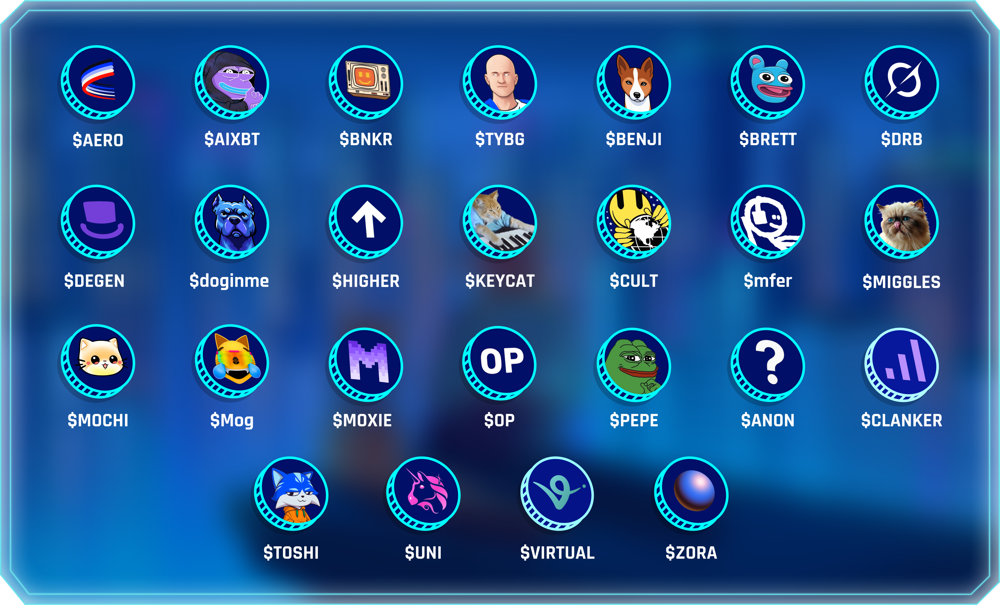

# Distribution Details


This article provides a complete breakdown of how the 20% $SHARD allocation for the Airdrop & Mining Season campaign is distributed, including eligibility criteria, reward mechanics, and the claiming process.


| Category               | Data                                                                                                                               |
| ---------------------- | ---------------------------------------------------------------------------------------------------------------------------------- |
| Mining Season Rewards  | 10% of supply (10,000,000,000 $SHARD)                                                                                              |
| Criteria-based Airdrop | 10% of supply (10,000,000,000 $SHARD)                                                                                              |
| Number of Criteria     | 25 eligible tokens and 9 eligible NFT collections. Holding any of them above the required threshold qualifies you for the airdrop. |
| Snapshot Date          | 
August 14, 2025 23:59:59 UTC

Base Block Number:  <a href="https://basescan.org/block/34213326">34213326</a>
    |
| Total Eligible Wallets |                                                                                                                                    |

## Overview

The Airdrop & Mining Season campaign consists of two reward pools, each receiving 10% of the total $SHARD supply:

1. **Initial Airdrop (10%):** Distributed to active ecosystem users captured in the snapshot.
2. **Mining Season Rewards (10%)**: Distributed to participants who collect Chests during the Mining Season, including those earned from referrals.

***

## **1. Initial Airdrop**

**Supply:** 10,000,000,000 $SHARD (10% of total supply)

#### **Eligibility Criteria**

There are two ways to qualify for the Initial Airdrop:

<figure><figcaption></figcaption></figure>

***

### Eligible Tokens List

<figure><figcaption></figcaption></figure>

| Token name                  | Contract Address                                                                                        |
| --------------------------- | ------------------------------------------------------------------------------------------------------- |
| Aerodrome ($AERO)           | [0x940181...d98631](https://basescan.org/token/0x940181a94a35a4569e4529a3cdfb74e38fd98631)              |
| aixbt by Virtuals ($AIXBT)  | [0x4f9fd6...d1a825](https://basescan.org/token/0x4f9fd6be4a90f2620860d680c0d4d5fb53d1a825)              |
| BankrCoin ($BNKR)           | [0x22af33...c76f3b](https://basescan.org/token/0x22af33fe49fd1fa80c7149773dde5890d3c76f3b)              |
| Base God ($TYBG)            | [0x0d97f2...fd38de](https://basescan.org/token/0x0d97f261b1e88845184f678e2d1e7a98d9fd38de)              |
| Basenji ($BENJI)            | [0xbc4564...2485f0](https://basescan.org/token/0xbc45647ea894030a4e9801ec03479739fa2485f0)              |
| Brett ($BRETT)              | [0x532f2...b142e4](https://basescan.org/token/0x532f27101965dd16442e59d40670faf5ebb142e4)               |
| DebtReliefBot ($DRB)        | [0x3ec215...d68ea2](https://basescan.org/token/0x3ec2156d4c0a9cbdab4a016633b7bcf6a8d68ea2)              |
| Degen ($DEGEN)              | [0x4ed4e8...efefed](https://basescan.org/token/0x4ed4e862860bed51a9570b96d89af5e1b0efefed)              |
| doginme ($doginme)          | [0x6921b1...8db75b](https://basescan.org/token/0x6921b130d297cc43754afba22e5eac0fbf8db75b)              |
| HIGHER ($HIGHER)            | [0x0578d8...ce0ffe](https://basescan.org/token/0x0578d8a44db98b23bf096a382e016e29a5ce0ffe)              |
| Keyboard Cat ($KEYCAT)      | [0x9a26f5...817973](https://basescan.org/token/0x9a26f5433671751c3276a065f57e5a02d2817973)              |
| Milady Cult Coin ($CULT)    | [0x000000...14eca4](https://etherscan.io/token/0x0000000000c5dc95539589fbd24be07c6c14eca4)              |
| mfercoin ($mfer)            | [0xe30868...3254ca](https://basescan.org/token/0xe3086852a4b125803c815a158249ae468a3254ca)              |
| Mister Miggles ($MIGGLES)   | [0xb1a03e...fef25d](https://basescan.org/token/0xb1a03eda10342529bbf8eb700a06c60441fef25d)              |
| Mochi ($MOCHI)              | [0xf6e932...c02e50](https://basescan.org/token/0xf6e932ca12afa26665dc4dde7e27be02a7c02e50)              |
| Mog Coin ($Mog)             | [0x2da56a...a7af71](https://basescan.org/token/0x2da56acb9ea78330f947bd57c54119debda7af71)              |
| Moxie ($MOXIE)              | [0x8c9037...4cd527](https://basescan.org/token/0x8c9037d1ef5c6d1f6816278c7aaf5491d24cd527)              |
| Optimism ($OP)              | [0x420000...00000042](https://optimistic.etherscan.io/token/0x4200000000000000000000000000000000000042) |
| Pepe ($PEPE)                | [0x698250...311933](https://etherscan.io/token/0x6982508145454ce325ddbe47a25d4ec3d2311933)              |
| Super Anon ($ANON)          | [0x0db510...6d950f](https://basescan.org/token/0x0db510e79909666d6dec7f5e49370838c16d950f)              |
| tokenbot ($CLANKER)         | [0x1bc0c4...6d1bcb](https://basescan.org/token/0x1bc0c42215582d5a085795f4badbac3ff36d1bcb)              |
| Toshi ($TOSHI)              | [0xac1bd2...31b2b4](https://basescan.org/token/0xac1bd2486aaf3b5c0fc3fd868558b082a531b2b4)              |
| Uniswap ($UNI)              | [0x1f9840...01f984](https://etherscan.io/token/0x1f9840a85d5af5bf1d1762f925bdaddc4201f984)              |
| Virtual Protocol ($VIRTUAL) | [0x0b3e32...4e7e1b](https://basescan.org/token/0x0b3e328455c4059eeb9e3f84b5543f74e24e7e1b)              |
| Zora ($ZORA)                | [0x111111...0afc69](https://basescan.org/token/0x1111111111166b7fe7bd91427724b487980afc69)              |

***

## 2. Mining Season Airdrop

**Supply:** 10,000,000,000 $SHARD (10% of total supply)

During the Mining Season, users can earn Chests every **8 hours** in the **Mine** tab or by inviting others through referral codes. All Chests collected during the event will be converted into $SHARD after the campaign ends.

**Key Notes:**

* There is no limit to the number of Chests a user can collect.
* The more Chests you collect, the larger your share of the $SHARD pool.
* The leaderboard reflects top participants based on Chest count.

***

## Reward Formula

At the end of the Mining Season, rewards come from two pools:

* **Initial Airdrop Pool**: 10% of total supply (**10,000,000,000 $SHARD**)
* **Mining Pool**: 10% of total supply (**10,000,000,000 $SHARD**)

Both are distributed first to all eligible users. If a user does not own at least one Crystal NFT after the Crystal Sale, their entire allocation is returned to the **Redistribution Pool**.

Final distribution is then recalculated among Crystal holders with multipliers applied.

***

## Example Calculation

### **Step 1: Mining Season**

10,000 Chests are collected in total.\
Mining Pool = 10,000,000,000 $SHARD ÷ 10,000 = **1,000,000 $SHARD per Chest**.

Bob collects 25 Chests → **25,000,000 $SHARD**.

### **Step 2: Initial Airdrop**

Bob also qualifies for 125,000 $SHARD from the Initial Airdrop Pool.\
His **total initial allocation** = **25,125,000 $SHARD**.

### **Step 3: Redistribution Pool**

Across all users without Crystals:

* 2,000,000,000 $SHARD from Initial Airdrop
* 2,500,000,000 $SHARD from Mining Rewards\
  Redistribution Pool = **4,500,000,000 $SHARD**

### Step 4: Multipliers

Crystal multipliers apply to user allocations:

| Crystals Owned | Multiplier |
| -------------- | ---------- |
| 1              | 1.0×       |
| 2              | 1.3×       |
| 3              | 1.6×       |
| 4              | 2.0×       |
| 5+             | 2.5×       |

Bob owns 2 Crystals → multiplier **1.3x**.\
His weighted allocation = **25,125,000 × 1.3 = 32,662,500**.


All weighted allocations are summed across Crystal holders. Redistribution Pool (4,500,000,000 $SHARD) is distributed proportionally to these weights.


### **Step 5: Final Reward**

Bob receives his **initial allocation** + **share of Redistribution Pool**.\
This ensures the total never exceeds the fixed 20% supply.

***

## How to Claim

### Step 1: Earn Your Allocation

* **Initial Airdrop**: If your wallet met the snapshot criteria, you received an allocation.
* **Mining Season**: Collect Chests every 8 hours and invite friends for bonus Chests.

### Step 2: Acquire a Crystal NFT

After Mining Season, the Crystal NFT Sale takes place.\
Crystals are the foundational NFTs of the Farlegacy ecosystem. Without a Crystal, your rewards remain locked and are redistributed.

### Step 3: Redistribution and Multipliers

Once the Crystal Sale ends, unclaimed rewards are pooled together.\
Crystal holders receive this pool proportionally, with multipliers applied depending on how many Crystals they own.

### Step 4: Claim Your $SHARD

After redistribution is finalized, Crystal holders can claim their final $SHARD rewards in the Farlegacy app.
