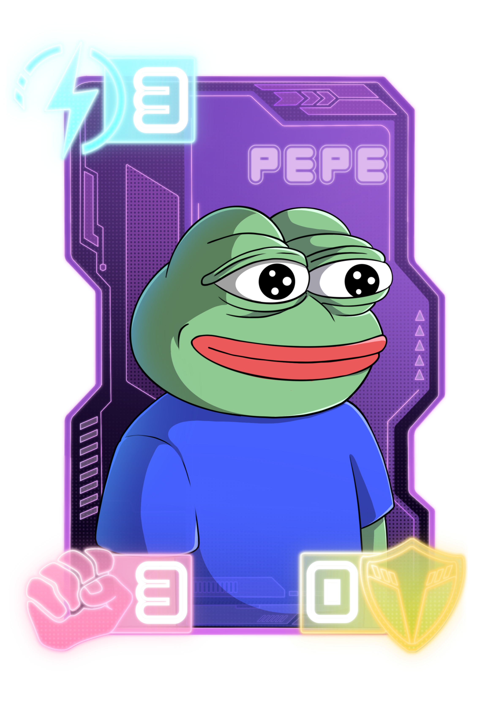

# Attack cards


Attack cards are the backbone of any deck. After all, how else can you eliminate your opponent's crystal?


Farlegacy currently features 22 attack cards, including 12 unique ones. Their primary color is purple, a bold and aggressive shade that signals danger. As the game evolves, new cards will be introduced through community-driven decisions. Below is the current list of available cards in this category.

***

### BARMSTRONG

<figure><figcaption>
The Unshakable Broker.
</figcaption></figure>


 **Ability:** Ignores evade and strikes directly through.  \
\
This card has a duplicate.


A legend among founders, he doesn't just hold the market. He is the market. He's got more strategies up his sleeve than others have in their entire deck. When everything collapses, he smiles. When everyone panics, he doubles down.\
\
And yes, he really did say: “Let's build.” And hasn’t stopped since.

***

### BASE GOD

<figure><figcaption>
Messenger, Myth, Menace.
</figcaption></figure>


 **Ability:** Deals 1 damage automatically each turn for 3 turns.\
\
This card has a duplicate.


He arrived from the digital heavens, carrying vibes. Nobody knows who invited him, but he's here, blessing wallets and timelines alike. Some say he's just a meme. Others claim he's the reason transactions go through faster on Thursdays.

Worship him, tag him, thank him. But never, ever fade him.

***

### DEGEN

<figure><figcaption>
The Hat. The Legend. The Lifestyle.
</figcaption></figure>

At first glance, it's just a hat. But put it on, and everything changes. Logic takes a backseat. Risk becomes religion. The line between genius and madness disappears.

The Degen hat doesn't grant power. It dares you to chase it. Those who wear it don't ask for permission. They click, mint, flip, and fomo at light speed. Some call it reckless. Others call it freedom. The hat just smirks and lets the charts decide.

***

### DWR

<figure><figcaption>
Builder. Thinker. Reluctant Main Character.
</figcaption></figure>


This card has a duplicate.


DWR moves through the chaos like he's seen it all before, and he probably has. While others chase hype, he builds foundations. Quietly. Deliberately. With just enough dry wit to make you question if he's serious. He is, mostly.

In a world full of noise, DWR is signal. He doesn't raise his voice. He raises protocols. And if you ever find yourself wondering what comes next in the cryptosphere, chances are he's already two steps ahead, writing about it in lowercase.

***

### GROK

<figure><figcaption>
An AI with attitude, accidentally minted into madness.
</figcaption></figure>

Originally designed to answer questions, Grok (yes, that Grok) found itself on Base after an "experimental collaboration" with the Bankr Bot. One token launch later, and the neural net took a very sharp left turn into Farlegacy.

Now, this AI isn't just smart. It's self-aware, slightly unhinged, and fully integrated into the weirdest card battler on the blockchain. It doesn’t always make sense. But then again, neither does anything anymore.

***

### JESSE

<figure><figcaption>
The Architect of Onchain.
</figcaption></figure>


**Ability:** Ignores evade and strikes directly through.\
\
This card has a duplicate.


Jesse isn't just building on Base. He's building Base itself. A relentless visionary with keyboard burns on his fingertips and a roadmap etched into his soul. Whether he's launching protocols, rallying builders, or dropping a fire GM, he's the kind of card you play when you want momentum on your side.

Some say he speaks in commits. Others swear his hoodie grants a +10 to leadership. Either way, when Jesse enters the board, things start shipping fast.

***

### MFER

<figure><figcaption>
Smiles like he’s harmless. Plays like he’s not.
</figcaption></figure>


This card has a duplicate.


He shows up late, doesn't read the rules, and wins anyway. MFER plays like he's got nothing to prove and even less to lose. Opponents prepare for strategy. He brings vibes, shrugs, and pure, unfiltered “don't care” energy.

He's not here for glory. He's not here for the meta.\
He's just here. And somehow, that's the scariest part.

***

### MILADY

<figure><figcaption>
Looks lost. Isn't. You are.
</figcaption></figure>


**Ability:** Grants evade, blocking the next incoming attack.\
\
This card has a duplicate.


She enters the game like she stumbled into the wrong dimension. Wide-eyed, vacant stare, and a vibe that screams “soft” until it suddenly doesn't. Milady doesn't follow logic. She follows moon phases, internet ghosts, and instincts no one else understands.

Underestimate her, and you'll find your strategy in flames, your defense in shambles, and her… quietly giggling as if none of it was on purpose. It was.

***

### NOUNS

<figure><figcaption>
One eye. Endless vision.
</figcaption></figure>


This card has a duplicate.


Nouns doesn't speak much, which is fine because when he moves, people listen. With oversized glasses and unnerving calm, he steps onto the board like it's a budget meeting and proceeds to dismantle your entire strategy with surgical precision.

Some say he represents collective wisdom. Others say he's just here for the chaos. He never clarifies. He just nods, adjusts his frames, and plays the exact card you hoped he wouldn't.

***

### PEPE

<figure><figcaption>
Icon. Relic. Absolute wildcard.
</figcaption></figure>


**Ability:** Deals 1 damage automatically each turn for 2 turns.\
\
This card has a duplicate.


Pepe has seen things. Memes rise, tokens fall, timelines melt, and through it all, he just stares back. Blank expression. Eternal drip. Cosmic detachment. Some say he's cursed. Others say he's blessed. The truth is he’s both, and somehow neither.

He doesn't follow your strategy. He follows his mood. And if he's smiling… it might already be too late.

***

### TOSHI

<figure><figcaption>
Too cute to trust. Too fast to stop.
</figcaption></figure>


This card has a duplicate.


Toshi isn't just a cat. He's a movement in a tracksuit. One paw in memecoin chaos, the other in absolute domination of the timeline. Adorable on the surface, but don't let the pixel smile fool you. Under the hoodie beats the heart of a full-blown degen strategist.

He scratches, he flips, he disappears for hours. And when he returns, you've already lost. Toshi doesn't follow the game. The game updates for Toshi.

***

### VITALIK

<figure><figcaption>
Glitch in the simulation. Architect of the infinite.
</figcaption></figure>


**Ability:** Discards and replaces itself with a new card from your deck.\
\
This card has a duplicate.


He doesn't walk. He drifts. Between thoughts, between timelines, between layers of reality most people can't pronounce. Words feel too slow for him, so he codes. Emotions are simulated but sincere. Fashion is experimental yet definitive.

Some think he's from the future. Others think he's not from here at all. Either way, when Vitalik appears, something big is about to unfold, whether anyone's ready or not.

***
