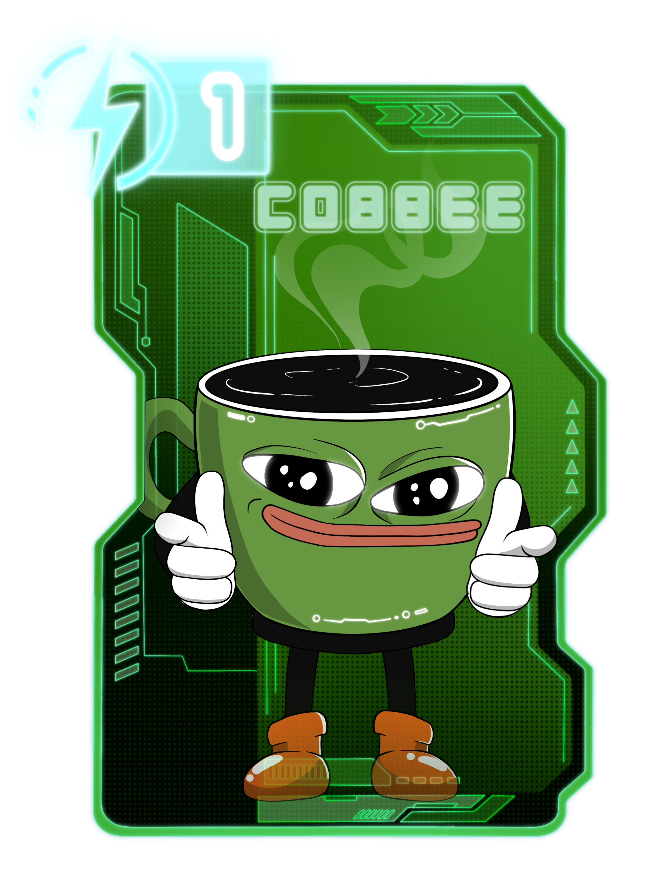
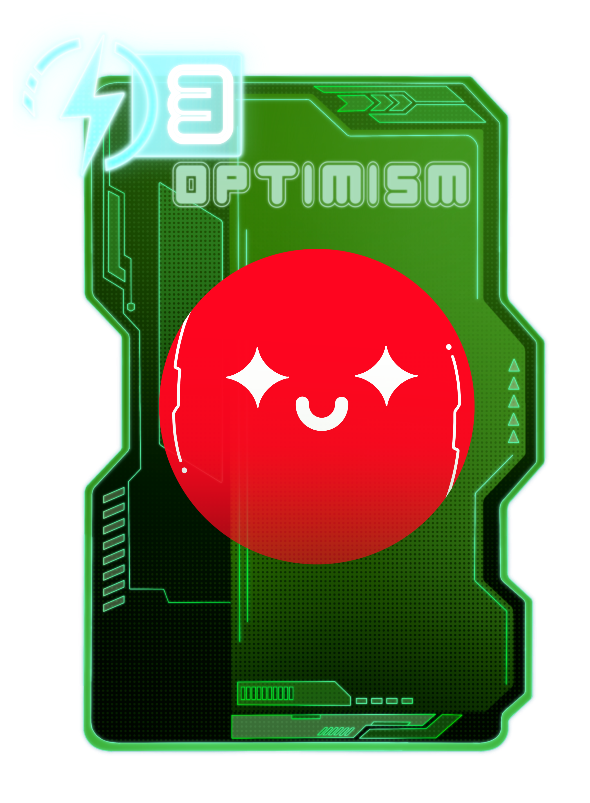

# Heal cards


Heal cards restore health to your crystal. They're your best chance to recover after a heavy hit or to buy time before the next one lands.


Farlegacy currently includes 9 heal cards, 5 of which are unique. Their main color is green, a signal of recovery, balance, and second chances. These cards restore health to your crystal, offering relief in an otherwise relentless match. Whether used for survival or tempo control, heal cards can shift momentum when played at the right time. More may be introduced in the future as the game evolves and community feedback shapes new mechanics. Below is the current list of available cards in this category.

***

### AERO

<figure><figcaption>
Wipe it clean. Breathe again.
</figcaption></figure>


**Ability:** Removes one negative status effect from your crystal (either burn or evade).


Aero doesn’t panic. It stabilizes. When everything’s stuck, stacked, or spiraling, it cuts through the noise and clears the status. Quietly efficient. Brutally refreshing. You don’t always need a boost. Sometimes you just need a reset.

***

### COBBEE

<figure><figcaption>
Half frog. Half caffeine.
</figcaption></figure>


**Ability:** Restores 2 health to your crystal.


Cobbee doesn’t walk. It jitters. A cup with limbs, a purpose, and probably way too much espresso in its system. It doesn’t ask how bad things are. It just shows up, piping hot, and kicks your health back into motion.

Some cards heal with grace. This one does it with energy. And a hint of chaos.

***

### HIGHER

<figure><figcaption>
Back up. Head clear. Eyes forward.
</figcaption></figure>


**Ability:** Restores 3 health to your crystal.


Higher doesn’t heal with softness. It heals with momentum. It doesn’t whisper “you’re okay.” It says, “keep going.” When the match feels heavy and the hits stack high, HIGHER kicks in like a second wind on-chain.

It’s not just recovery. It’s elevation.

***

### OPTIMISM

<figure><figcaption>
No fear. Just forward.
</figcaption></figure>


**Ability:** Restores 5 health to your crystal.


Optimism doesn’t patch. It restores. When all feels lost, this card reminds you that not everything is damage. It’s the calm after collapse, the breath between turns, the moment you realize you’re not done yet.

**Optimism always wins.**

***

### UNI

<figure><figcaption>
Born to swap. Built to shimmer.
</figcaption></figure>


 **Ability:** Removes two negative status effects from your crystal (burn and evade).


Uni doesn’t gallop. It glides. Effortless, radiant, and too graceful to bother explaining itself. It’s been everywhere, seen everything, and still shows up with a smile and a trail of sparkles.\
\
People follow trends. Uni sets them without making a sound.

***
