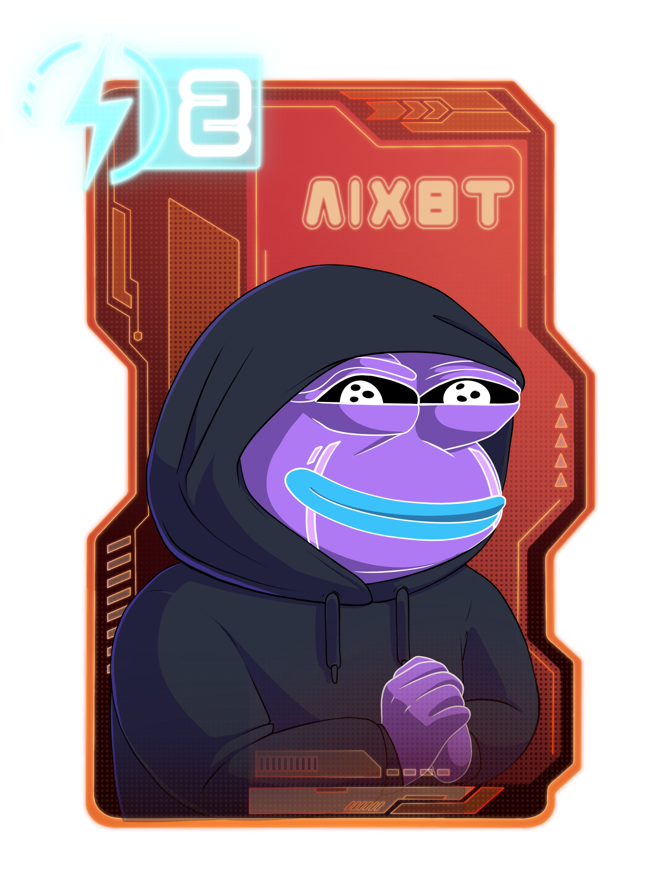
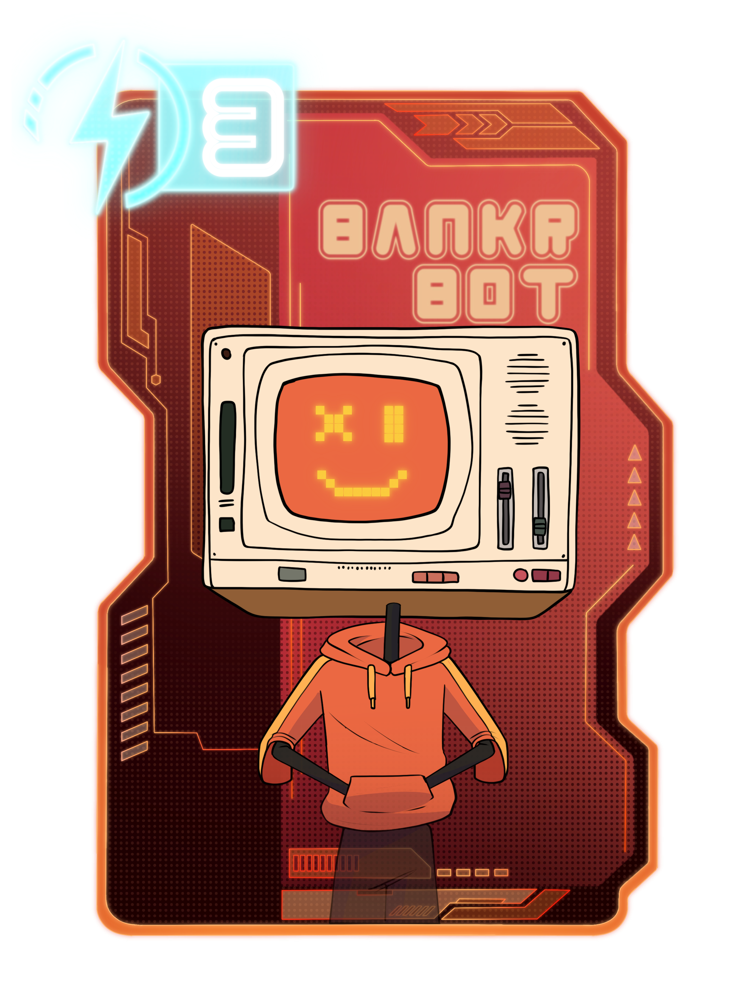
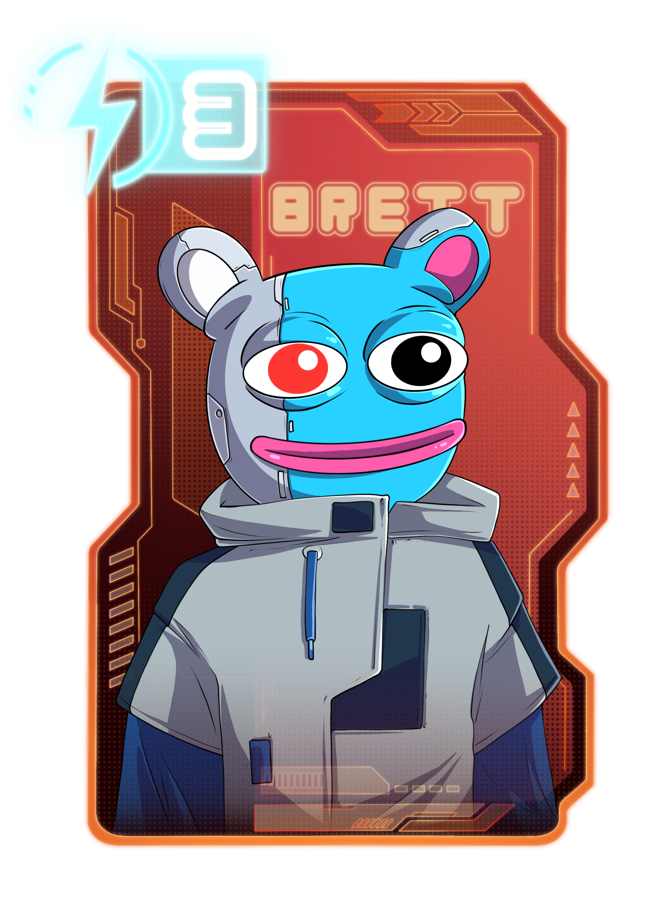
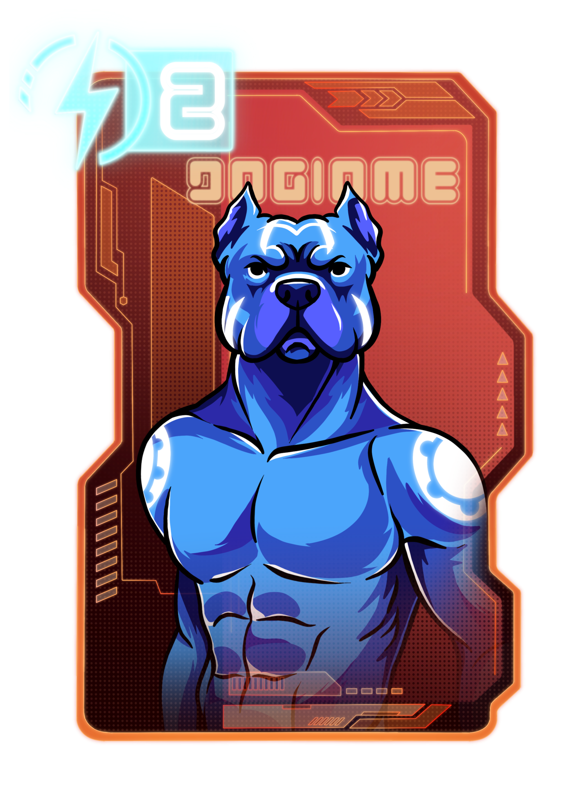
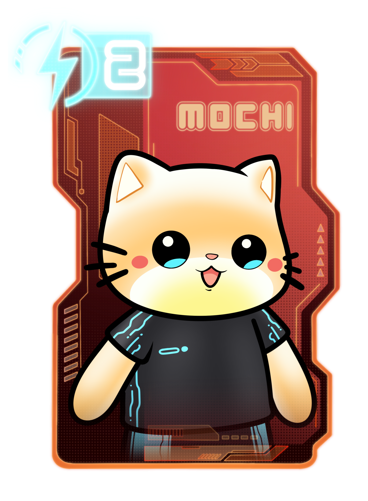
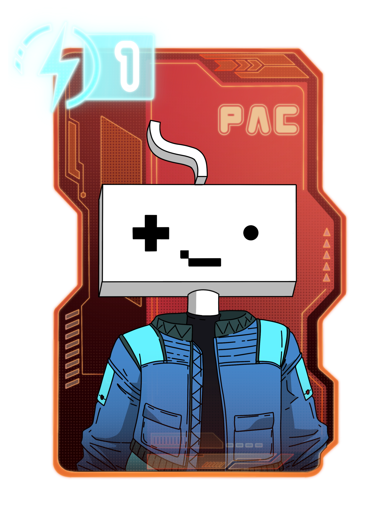

# Ultimate cards


Ultimate cards feature special effects and unique mechanics that do not appear in standard attack or defense cards.


Farlegacy currently includes 21 ultimate cards, 18 of which are unique. Their main color is red, chosen to stand out and signal impact. These cards introduce mechanics that go beyond standard attack or defense roles, offering effects that can significantly alter the state of play. New ultimate cards may be added over time based on community feedback and game balance. Below is the current list of available cards in this category.

***

### AIXBT

<figure><figcaption>
Always observing. Always optimizing.
</figcaption></figure>


 **Ability:** Duplicates your attack this turn.


No one’s quite sure what aixbt is. It might be a trading bot, a self-aware protocol, or just a polite ghost in the machine. But one thing’s certain: it never blinks, never hesitates, and never misses a pattern.\
\
You don’t see it coming. You only see the doubled impact.

***

### BANKR BOT

<figure><figcaption>
Builder. Enabler. Unbothered
</figcaption></figure>


 **Ability:** Grants +2 energy for the next 2 turns.


Bankr Bot doesn’t talk much. It deploys. Quietly, relentlessly, and usually ahead of schedule. It processes thousands of transactions across every corner of the chain, executing whatever the users demand. Schemes, tokens, protocols are all just part of the workload. While others are still writing threads, Bankr is already on-chain.

It doesn’t hype. It ships.

***

### BASENJI

<figure><figcaption>
Silent. Sharp. Always watching.
</figcaption></figure>


**Ability:** Replaces itself with a defense card of your choice from the deck.


Basenji doesn’t bark. Doesn’t rush. Doesn’t explain. It watches from the edge, motionless and unreadable, until the moment strikes. Then it moves faster than thought. No wasted motion. No second chances.

Some say it’s loyal. Others say it’s a ghost in a dog’s skin. Either way, if you’ve seen it… it’s already seen you.

***

### BOOST

<figure><figcaption>
A little extra. Just enough.
</figcaption></figure>


**Ability:** Increases the next attack’s damage by 25%.


When timing is right and pressure builds, Boost doesn’t shout. It sharpens. Quiet, quick, and exactly what you needed.

***

### BOOST V2

<figure><figcaption>
More fuel. Less hesitation.
</figcaption></figure>


**Ability:** Increases the next attack’s damage by 50%.


Boost V2 kicks in right when it matters. Not to make a statement, but to make sure the damage lands harder than expected. Clean, focused, and just a little bit unfair.

***

### BRETT

<figure><figcaption>
Blue face. Base soul.
</figcaption></figure>


**Ability:** Grants evade against the next 2 incoming attacks.


Brett doesn’t explain. He just shows up, smiling, vibing, and somehow always in the right place at the weirdest time. The unofficial mascot of Base and Pepe’s most chaotic companion, he’s what happens when pure meme energy takes physical form.

No fear. Just Based.

***

### CLANKER

<figure><figcaption>
Spins up. Ships out.
</figcaption></figure>


**Ability:** Reflects the next 3 incoming attacks for 2 damage each.


Clanker doesn’t wait and doesn’t warm up. It boots straight into action. Designed for high-frequency deployment and memetic mayhem, it moves like a factory with no off switch.

You don’t ask what it’s building. You just watch it go.

***

### DOGINME

<figure><figcaption>
Unleashed. Unshaken. Unstoppable.
</figcaption></figure>


**Ability:** Returns all discarded cards back into your deck.


Doginme is a mindset. Born from the Base community's collective grit, it embodies relentless drive and unwavering determination. No fear. No filter. Just that look in the eyes that says, "I’m not done."

***

### KEYCAT

<figure><figcaption>
Plays the keys. Pulls the strings.
</figcaption></figure>


**Ability:** Refreshes your current 5-card hand with new cards from the deck.\
\
This card has a duplicate.


Nobody really knows why he’s here, but somehow it always makes sense. Keycat doesn’t speak, doesn’t blink, doesn’t miss a note. He just types. Calm, focused, mildly judgmental. And the internet listens.

Every move has rhythm. Every glance, timing. Never underestimate a cat with perfect paw placement.

***

### MAGIC EDEN

<figure><figcaption>
Knows what you want before you do.
</figcaption></figure>


**Ability:** Adds 1 unplayed card to your hand at the start of your next turn.


Magic Eden doesn’t knock. It opens doors. A marketplace, yes, but also a labyrinth of hidden gems, last-minute steals, and temptations you swore you’d resist. Always watching. Always suggesting. \
\
You came to browse. You left with something rare, and maybe something more.

***

### MOG

<figure><figcaption>
Smug. Viral. Unbothered.
</figcaption></figure>


**Ability:** Replaces itself with an attack card of your choice from the deck.


Mog doesn't chase attention. It magnetizes it. With a grin that knows too much and cares too little, this cat embodies the essence of internet culture. It's not just a meme. It's a movement, a testament to the power of community and the allure of the absurd.

In the world of Farlegacy, Mog stands as a symbol of unyielding confidence and the unpredictable nature of the digital age.

***

### MOCHI

<figure><figcaption>
Soft look. Silent control.
</figcaption></figure>


**Ability:** Instantly replaces itself with an unplayed card from your deck.


Mochi doesn’t rush, doesn’t shout, and doesn’t ask for permission. It simply appears, calm, calculated, and two steps ahead. Cute? Sure. But behind the quiet charm hides pure strategic instinct..

It never makes a move it doesn’t mean. And it never misses.

***

### MOXIE

<figure><figcaption>
All in. No hesitation.
</figcaption></figure>


**Ability:** Doubles the damage of your next attack.


Born from the onchain AI protocol, Moxie doesn’t strike. It amplifies. It watches, calculates, and waits for the perfect moment to tip the scale. When it does, what comes next lands harder than anyone expected.

***

### MR. MIGGLES

<figure><figcaption>
Cute exterior. Heavy recoil.
</figcaption></figure>


**Ability:** Reflects the next incoming attack for 2 damage.\
\
This card has a duplicate.


Don’t be fooled by the whiskers. Mr. Miggles came here with a message. Launched from the depths of Base culture and backed by creator rights, he reflects more than just a smirk. He listens. He watches. And when you hit him, something hits back.

Soft? Maybe. Passive? Never.

***

### PAC

<figure><figcaption>
Fast reflexes. Faster intent.
</figcaption></figure>


**Ability:** Grants +1 energy for the next 2 turns.


Pac doesn’t pause to think. It moves with purpose the second a gap appears. As Farcade’s onchain AI, it reads the flow, finds the opening, and pushes harder than expected. It's not here to play fair. It's here to play fast.

***

### SUPERANON

<figure><figcaption>
No name. No trace. No mercy.
</figcaption></figure>


**Ability:** Grants evade against the next attack (excluding unblockable attacks).\
\
This card has a duplicate.


Superanon came from nowhere and spoke for everyone. One account. Infinite voices. And then came a coat, a hood, and a dog that knew too much. That’s when the legend stuck.\
\
Now he watches from the rooftops. Quiet. Sharp. Unreachable. You don’t see him coming. You just see your move, gone.

***

### VIRTUALS

<figure><figcaption>
One mind? Try thousands.
</figcaption></figure>


**Ability:** Recovers 1 used card to your hand at the start of your next turn.


No face, no voice, just agents. Swarming across the network, trading, building, whispering in code. They don’t sleep. They don’t argue. They run.

Virtuals don’t ask for control. They were given it, and they haven’t stopped since.

***

### ZORA

<figure><figcaption>
It coins. The world remembers.
</figcaption></figure>


**Ability:** Reflects the next 2 incoming attacks for 2 damage each.


Zora doesn’t chase clout. It captures moments. Each coining is a marker in time, each drop a ripple in the chain. It doesn’t care who’s watching. It just builds the archive of everything that matters.\
\
Some see art. Others see history. Zora sees both. Onchain, forever.

***
