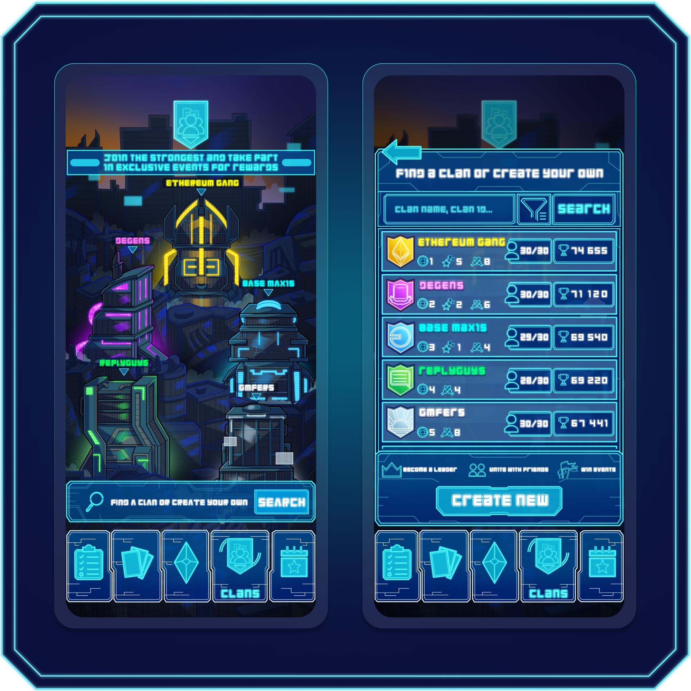

# Clans


Clans are the foundation of community, coordination, and competition in Farlegacy. While solo play is possible, Clans unlock the deepest layers of the game's strategy, social dynamics, and seasonal rewards.


## What Are Clans?

<figure><figcaption></figcaption></figure>

Clans are player-created groups that bring individuals together under a shared identity. In the world of Farlegacy, they act as both social hubs and competitive factions. Every Clan is built by players and defined by their performance, activity, and reputation.

Joining a Clan gives you access to:

* Exclusive Clan-only events and seasonal Clan Wars
* Collective rewards based on performance
* A team to strategize, coordinate, and grow with

***

## Creating and Expanding a Clan

Founding a Clan requires spending a fixed amount of $SHARD:&#x20;

* Create a Clan: 10,000 $SHARD
* Expand to 20 members: 2,500 $SHARD
* Expand to 30 members (max): 5,000 $SHARD

Each expansion tier unlocks more membership slots, increases your visibility on the Clan leaderboard, and enhances your Clan's potential in competitive events.


Only the Clan leader can initiate and pay for expansions.


***

## Clan Levels and Structure

All Clans begin at Level 1, with 10 member slots by default. As they grow, Clan leaders can upgrade to Level 2 (20 members) and eventually Level 3 (30 members).

* Level 1 (10 players): Fast coordination, ideal for new groups
* Level 2 (20 players): Expanded flexibility and competitive presence
* Level 3 (30 players): Maximum member cap, ideal for top-tier performance


Clans can be public (anyone can join) or invite-only (manually approved).


***

## Clan Events and Wars

#### Clan-Only Events

These are competitive PvP events designed exclusively for Clan members. Each event introduces unique rules, modifiers, or deck restrictions that test coordination, adaptability, and team-wide synergy. Clan-Only Events are the primary battlegrounds where group strategy truly shines.

#### Clan Wars

Seasonal competitions where Clans go head-to-head for leaderboard dominance. Performance in these wars determines:

* Seasonal reward allocations
* Special cosmetic unlocks
* Legacy prestige in the city of Farlegacy

#### Clan Leaderboard

An ever-updating public board that displays:

* Total trophies earned
* Win rates in wars
* Member activity
* Clan level and size

Top Clans receive end-of-season rewards and recognition.
