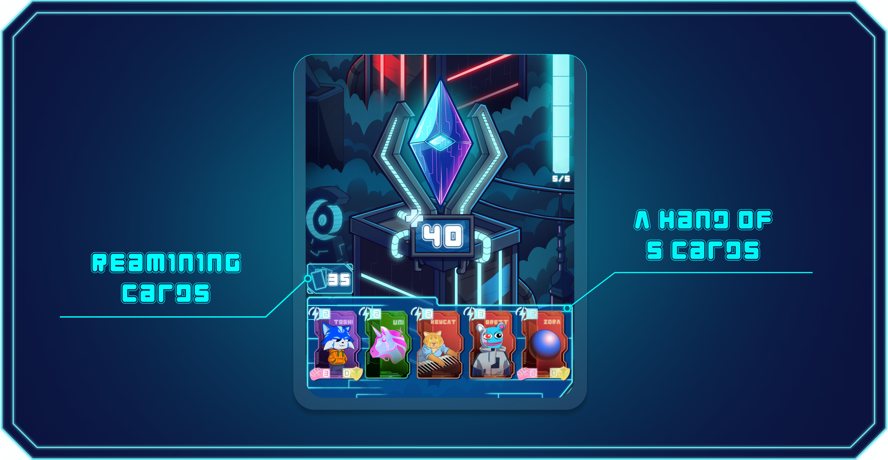

# Rules

Farlegacy is a fast-paced, card-based PvP game where two players compete to destroy each other's Crystal. Every match follows a consistent structure based on turns, energy, and deck cycles. This section covers all the key rules that define gameplay.

***

## Objective

Each player starts with 40 HP on their crystal. The goal is to reduce the opponent's crystal health to 0 before they do the same to yours.

***

## Turn Structure

Each player takes turns. A single turn follows this sequence:

* Gain 5 energy
* Draw as many new cards as you played last turn
* Play any number of cards, as long as energy allows
* End turn, and pass control to the opponent


Unplayed cards remain in your hand. At the start of your next turn, your hand is refilled back to 5 cards by&#x20;

drawing as many new ones as you used during the previous turn.


***

## Deck and Hand

* You can build a deck with 20 to 40 cards.
* Your hand always contains 5 cards at the start of each turn.
* The deck only reshuffles automatically once you have played all cards from the deck and your hand, meaning there are no more cards to draw or play.
*

    <figure><figcaption></figcaption></figure>

***

## Card Types

There are four types of cards in Farlegacy, each with a distinct role in battle:

<figure><figcaption></figcaption></figure>

***

## Crystal Mechanics

* Every player starts with a Crystal that has 40 H&#x50;**.**
* When the HP drops to 0, the player immediately loses.
* Healing and defense cards can support the Crystal but cannot save it once its HP reaches zero.

***

## Status Effects

Cards can apply temporary status effects that last for multiple turns. Common ones include:

<figure><figcaption></figcaption></figure>

***

## Match Flow

* Games are 1v1 and turn-based
* Deck cycles only after all cards from the deck and hand are used
* Strategy lies in hand timing, energy management, and card synergy


Victory favors players who can predict, adapt, and pressure their opponent effectively.

