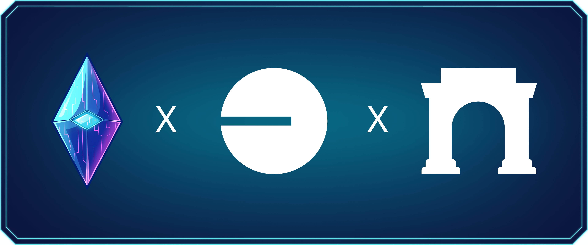

# Guide

**Welcome to the Farlegacy Guide!** \
\
This is your starting point for understanding how the game works, what to expect as a new player, and how to progress efficiently. This section covers the core systems, from deck building and leveling to quests, rewards, and beyond. Whether you're here to compete or just explore, this guide will help you make the most of every step.

***

## Getting Access

<figure><figcaption></figcaption></figure>

Before anything else, you'll need a key, literally.

To play Farlegacy, you must own a Crystal NFT. These NFTs act as access passes, representing your identity, your entry point, and your crystal in-game.

Don't have one yet? Keep an eye on our official channels for the announcement, giveaways, and whitelist opportunities.


Owning a crystal gives you access to future drops and more in the Farlegacy universe.


***

## Platform & Ecosystem

<figure><figcaption></figcaption></figure>

Farlegacy is:

* Built on the Base blockchain (L2, via Optimism)
* Available exclusively via Farcaster

To play, you'll need:

* Access to [Farcaster](https://farcaster.xyz/) (download from [App Store](https://apps.apple.com/us/app/warpcast/id1600555445) / [Google Play](https://play.google.com/store/apps/details?id=com.farcaster.mobile))
* A wallet, but the built-in Farcaster wallet is all you need. To access the game, it must hold an NFT Crystal or have one verified in your Farcaster account settings
* A small amount of ETH on Base for gas (used during minting or advanced interactions, but not required just to play)

***

## Match Interface Overview

<figure><figcaption></figcaption></figure>


Every match is turn-based and lasts about 8–12 minutes.


***

## Your Cards

Every player starts with a ready-to-play deck of 20 cards, the minimum required to enter a match. As you collect more cards, you can expand your deck up to a maximum of 40. You are free to choose any number of cards within that range, whether you prefer a lean 20-card strategy or a more versatile 40-card build.

During a match, you always hold five cards in hand. At the start of each turn, you draw exactly as many new cards as you played during the previous turn. Once you've cycled through your full deck, it reshuffles automatically, keeping the action flowing.

Cards are divided into four functional categories:

* Attack — deal damage to your opponent’s Crystal
* Defense — reduce or avoid incoming damage
* Heal — restore health to your Crystal
* Ultimate — powerful utility or game-changing effects


No custom deck is required to begin. Your starter set gives you everything you need to jump in and compete from day one.


***

## Turn Mechanics

Each turn:

* Gain 5 energy
* Draw as many cards as you played last turn
* Play any number of cards (if energy allows)
* End turn → opponent’s turn

***

## Status Effects

Farlegacy features a variety of status effects that shape strategy and turn outcomes. Below are the most common mechanics you'll encounter:\

<figure><figcaption></figcaption></figure>

These effects can stack, overwrite, or neutralize each other based on card interactions and timing. Mastering them is key to higher-level play.

***

## What's Next?

As you play, you'll unlock new cards, refine your deck, and take part in events that test your strategy and reward your progress. Every match pushes you forward and brings new opportunities to grow stronger.

The Farlegacy community lives on [Discord](https://discord.gg/farlegacy), where players share tactics, feedback, and lore. Jump in, connect with others, and become part of the city's unfolding story.

You're now ready to enter the city. Good luck.
