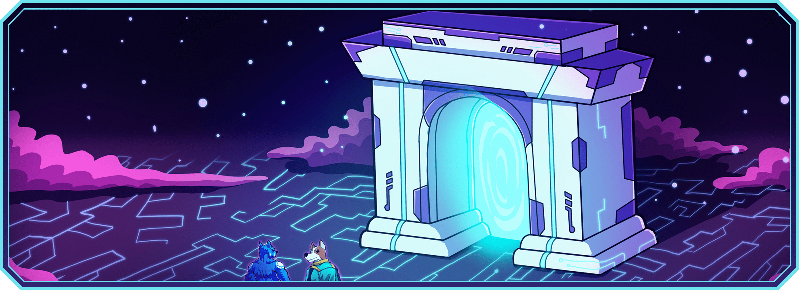

# Airdrop & Mining Season

<figure><figcaption></figcaption></figure>

## Overview

Airdrop & Mining Season is the first major campaign in the Farlegacy universe. It is designed to gather an early, engaged community ahead of the game's full launch, and reward them meaningfully for their early involvement.

In total, 20% of the total[ $SHARD token](usdshard-token/) supply is allocated to this campaign:

<figure><figcaption></figcaption></figure>

This campaign is your first opportunity to start earning $SHARD and position yourself ahead of the game's release.

***

## Mining Season

<figure><figcaption></figcaption></figure>

Mining Season is a limited-time event where users compete and collaborate to earn Chests, which will later be converted into $SHARD tokens.

### Key Mechanics

* You can claim 1 Chest every 8 hours. After claiming, a cooldown timer will begin before your next claim.
* The more Chests you accumulate, the more $SHARD you will receive at the end of the campaign.
* You can climb the Leaderboard by claiming consistently and referring others.

### Referrals

* Each player receives a referral code with 5 activations.
* When someone joins with your code and claims at least one Chest, you receive 1 bonus Chest.
* Once all 5 activations are used, your code will be refreshed with 5 new ones after 48 hours.

### Crystal Requirement

This system is designed to ensure long-term alignment between early contributors and committed players.

After the campaign ends, a limited collection of 5,000 Farlegacy Crystals will go on sale. These NFTs are the key to unlocking your $SHARD rewards earned during the Mining Season. Without a Crystal, your rewards will remain locked.

Once the sale is over, all unclaimed rewards will be permanently redistributed among Crystal holders. Even those who didn’t participate in the campaign but acquired a Crystal later.

This model encourages timely action, supports the ecosystem's growth through the Crystal sale, and ensures that only those who hold a stake in the Farlegacy universe benefit from its early distribution.

***

## Airdrop

<figure><figcaption></figcaption></figure>

#### Key Points

* 10% of the total $SHARD supply is reserved for the airdrop.
* This airdrop is first-come, first-served (FCFS): once the allocation is claimed, it's gone.
* Eligible users must claim their share through the Farlegacy app once the claiming is live.


All eligibility criteria are collected [here](airdrop-and-mining-season/eligibility-criteria.md), where you'll find a full breakdown of how eligibility is determined. The article includes details on the snapshot date, the total number of eligible wallets, and the full distribution logic.


***

## Timeline

* **Airdrop & Mining Season Launch:** -
* **Duration:** -
* **Crystal NFT Mint:** -
* **Token Generation Event (TGE):** -
* **Conversion of Chests into $SHARD:** Begins post-TGE

***

## Token Launch & Liquidity

All funds raised through the Crystal NFT sale will be used to seed liquidity for $SHARD on decentralized exchanges. We are committed to ensuring that early community participants benefit from real token utility and a healthy on-chain economy.

No team tokens will be distributed before the community has had their share. The campaign comes first.

