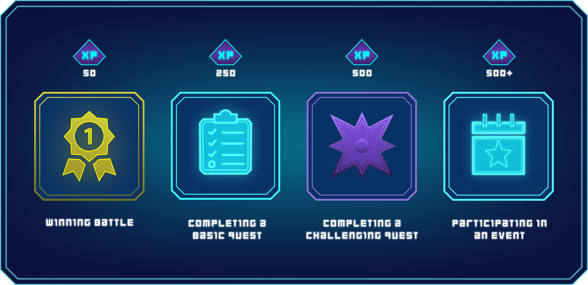

# Levels


A level in Farlegacy is a measure of your in-game progress. It reflects your experience, activity, and victories across all aspects of the game.


***

## How to Level Up

Every action you take in the game earns you experience (XP):

<figure><figcaption></figcaption></figure>


XP does not reset or expire at the start of a new season. The more you play, the higher your level becomes.


***

## Level Rewards

In addition to unlocking access to core gameplay features like clans and exclusive events, players also receive rewards in the form of $SHARD and card loot boxes:

<figure><figcaption></figcaption></figure>
