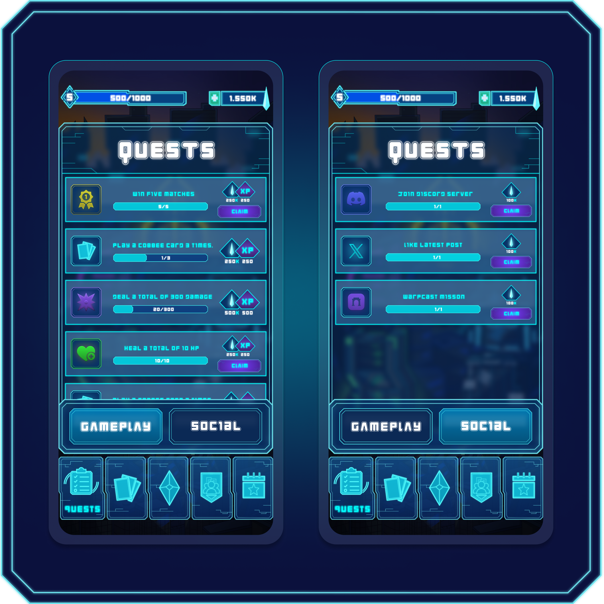

# Quests


Quests are short in-game tasks that reward you with XP and $SHARD. They refresh weekly and scale in difficulty and value.


***

## Quest Types

All quests in the game are divided into two types:

<figure><figcaption></figcaption></figure>

Gameplay quests reflect your actions in battle, while Social quests reward meaningful participation across Farlegacy's online presence. Each week, quests are refreshed and previous ones become unavailable, regardless of their type.&#x20;


To receive your reward after completing a quest, simply click the "Claim" button.

