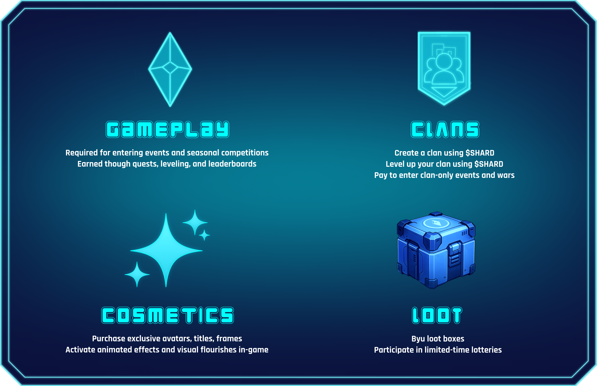

# $SHARD Token


$SHARD is the native utility token of Farlegacy.\
\
It powers progression, access to premium content, and player expression across the entire game. From clan wars to cosmetic upgrades, every meaningful layer of gameplay and competition runs through $SHARD.


<figure><figcaption></figcaption></figure>

***

## Overview & Tokenomics

<figure><figcaption></figcaption></figure>

***

## Core Utilities

<figure><figcaption></figcaption></figure>

$SHARD is the connective tissue of Farlegacy's entire ecosystem, shaping how players progress, interact, and stand out. Whether you're climbing ranks, personalizing your identity, or leading a clan to victory, $SHARD is the fuel behind the experience. Here's how it functions across the game:

***

## Burn Mechanics

Every $SHARD spent on:

* Event entries
* Cosmetic items
* Clan creation or expansion is burned, permanently removing it from circulation.

This deflationary loop helps maintain long-term value and scarcity.

***

## The Role of $SHARD

$SHARD is at the heart of Farlegacy. It fuels the game's economy and reward system and connects every core mechanic from battles and quests to clans and seasonal events.

As you play, $SHARD becomes a reflection of your progress and presence. It lets you expand your clan, unlock new opportunities, and personalize your identity within the game. Whether you are pushing the leaderboard, coordinating with allies, or shaping your place in the city, $SHARD is what turns effort into impact.
