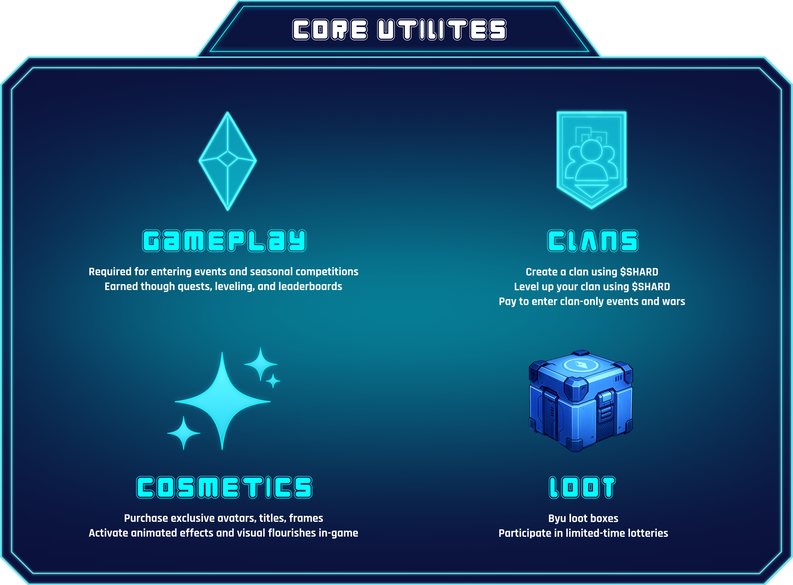

# $SHARD Token


$SHARD is the native utility token of Farlegacy.\
\
It powers progression, access to premium content, and player expression across the entire game. From clan wars to cosmetic upgrades, every meaningful layer of gameplay and competition runs through $SHARD.


<figure><figcaption></figcaption></figure>

***

## Overview & Tokenomics

<figure><figcaption></figcaption></figure>

***

## Core Utilities

<figure><figcaption></figcaption></figure>

$SHARD is the connective tissue of Farlegacy's entire ecosystem, shaping how players progress, interact, and stand out. Whether you're climbing ranks, personalizing your identity, or leading a clan to victory, $SHARD is the fuel behind the experience. Here's how it functions across the game:

***

## Burn Mechanics

Every $SHARD spent on:

* Event entries
* Cosmetic items
* Clan creation or expansion is burned, permanently removing it from circulation.

This deflationary loop helps maintain long-term value and scarcity.

***

## The Role of $SHARD

$SHARD was never an afterthought. It was envisioned and designed alongside the game from the very beginning. It serves as the foundation that connects every system in Farlegacy into a unified economy where gameplay, community, and ownership come together.

Whether you are competing, building and expanding your clan, or customizing your profile to stand out, $SHARD empowers your journey. It is the currency of progress and self-expression across every layer of the Farlegacy experience.
