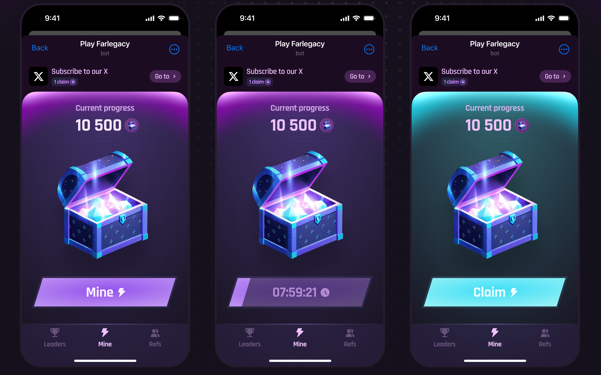

# Mining Season


Mining Season marks the first official event in Farlegacy, created to reward our earliest adventurers and rally the community ahead of launch.


Instead of waiting on the sidelines, you’ll dive in from day one as you mine NFT chests, bring friends into the world of Farlegacy, and get ready for the full launch.

<figure><figcaption></figcaption></figure>

***

## How It Works

Players can participate through a mini-app integrated directly into Farcaster. Once connected, you'll be able to mint a special NFT chest every 8 hours. Each chest contains a share of the $SHARD token supply, to be revealed and distributed after the event concludes.


Chests are unopenable until the end of the season.


<figure><figcaption></figcaption></figure>

To claim your rewards, you'll need to own a Crystal NFT, making Mining Season both an engagement event and a gateway into the Farlegacy economy.

